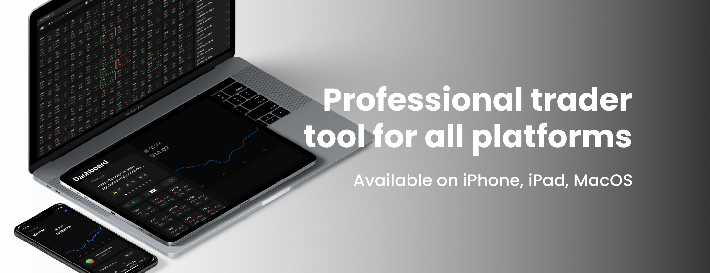
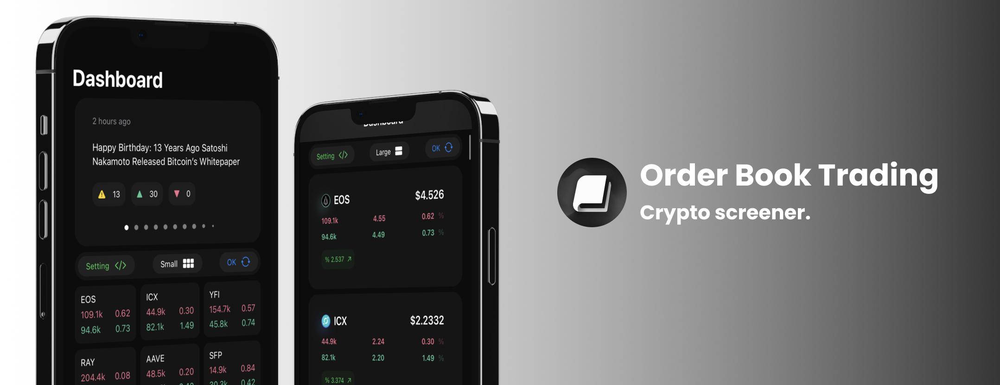
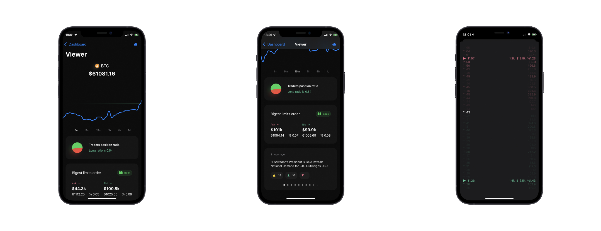

  # Order Book Trading

#### [App Store download link](apps.apple.com/app/id1590351885)

#### [Trading Strategy EN](pages/TradingStrategyEN.md), [RU](pages/TradingStrategyRU.md)
Trading strategy using the "Order Book Trading" application. Suitable for beginners. Designed for medium or short-term trading. Learning levels and limit clusters at levels

#### [Telegram channel](https://t.me/orderbooktrading)
 

  
An advanced platform is necessary to track the quickly changing cryptocurrency market. Our Coin Screener is customizable and is the most interactive in the crypto space. It displays multiple coins and timeframes on a single screen. Compared to the rest of the crypto space, our screener provides a comprehensive display of technical metrics helping you focus on potential entry and exit points.
  
  Last update:
  - Cryptocurrency Screener.
  - A completely new dashboard with the search for limits of more than 120 cryptocurrencies.
  - Data update in realtime.
  - New search settings and indicators.
  - Now for the iPad.
  

  
  Short list of features:
  - Screener. Automatic search for the biggest limit orders.
  - Chart.
  - Top traders positions ratio.
  - News with short/long indicator.
  
After launching the application, it connects to the websocket, that means that the data on prices and percentages are updated in real time. However, it takes about 30 seconds to get the order book of all currencies.

    
## Dashboard
    
The first thing you will see on the dashboard is a screener of all cryptocurrencies which futures can be traded on binance (there are more than 120 of them). We get the order book from the spot.

At the top left corner of the cell you can find the name of the currency.
- The upper line is displaying the price of the limit order in dollars and the distance from the price to limit order in percent for ask.
- The bottom line is displaying the price of the limit order in dollars and the distance from the price to limit order in percent for bid.

The color of the cell frame depend on whether the limit order is now for found at ask or at bid. If the cell frame is green, then the big limit is on the bid. If the cell frame red, then the big limit is on the ask. Pay attention to the intensity of the color! The brighet the color the bigger the limit order.
You can change the search filter in the settings.

## News

You can find and read the latest and most important news.
It is possible to choose a news language. On the main screen, general news. If you choose currency, you can see the corresponding news

How to understand the news indicators?
- A yellow exclamation mark indicates the importance of this news.
- The green triangle indicates that the news could trigger a rise in the price. 
- The red triangle indicates that the news could trigger a price decline.
- The higher the number of the indicator the stronger the signal.

## Chart

The line chart displays the price movement. The largest limits are shown with red and green lines.
On the upper view you can see at what price level the limit order is placed and the space between current price and limit order. By tapping the view you can switch the information about the limit order from dollars to coins and back.
This is a simple indicator of binance top traders positions for a specific currency. Short to long ratio.
If the text is green, then more the 50% of traders are now in the long.
If the text is rad then the most traders are in short.

#### [App Store](apps.apple.com/app/id1590351885)

#### [Trading Strategy EN](images/TradingStrategyEN.md)

#### [Telegram channel](https://t.me/orderbooktrading)
